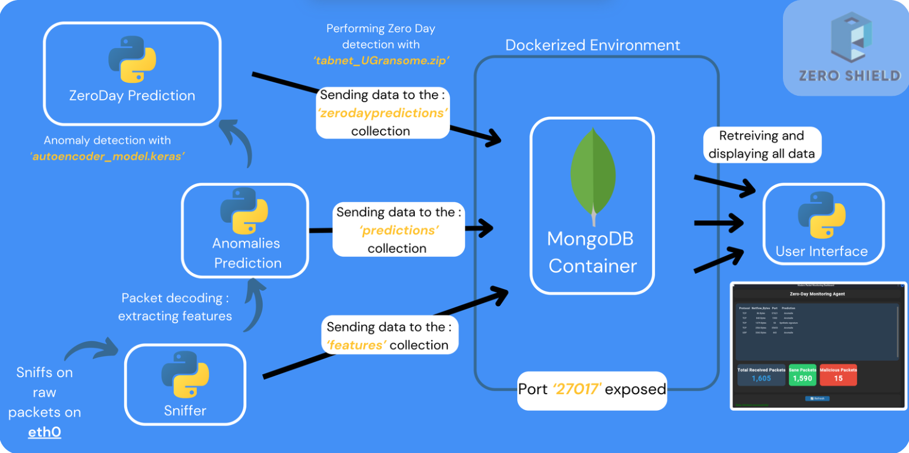
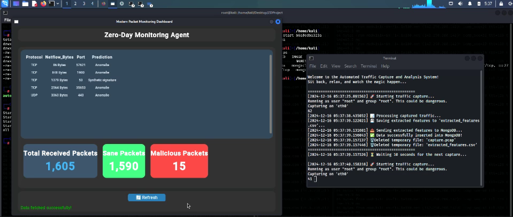
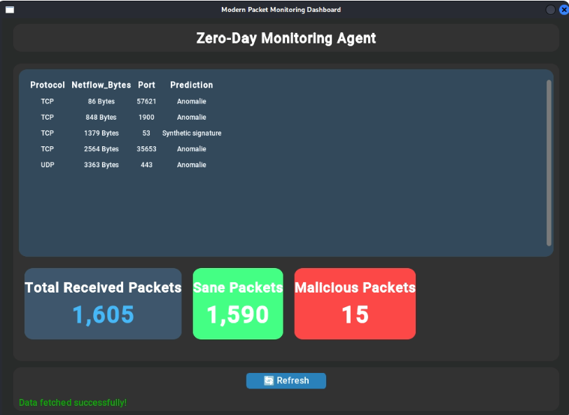
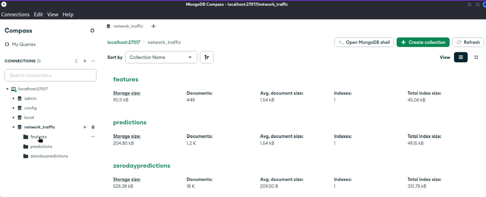

# ZeroShield 🛡️  

## Real-time Zero-Day Attack Detection for Linux Systems  

ZeroShield leverages advanced Machine Learning and Deep Learning techniques to detect and analyze potential zero-day attacks on Linux-based systems in real-time.

## 🔧 Project Architecture 



## 🎥 Project Preview
-------------

You can view the demo video [here](./screenshots/preview.mp4).

## 🚀 Quick Start  

### Prerequisites  

- Python 3.x  
- Docker  
- Linux-based system  
- Network access for traffic monitoring  

### Installation  
1. Update the system:

   On Linux-based systems:
   ```bash
   sudo apt update && sudo apt upgrade -y
   ```

2. Clone the repository:  

   ```bash
   git clone https://github.com/Yassinom/ZeroShield.git
   cd ZeroShield
   ```
   
3. Install dependencies:

   ```bash
   pip install -r requirements.txt
   ```
   
4. Start MongoDB container for traffic and prediction storage:

   ```bash
   docker run -d --name mongodb -p 27017:27017 mongo:latest
   ```   

5. Launch the application:

   ```bash
   chmod +x main.py
   ./main.py
   ```   

## 🛠️ Features
------------

* Real-time network traffic monitoring
* ML/DL-based threat detection
* Zero-day attack pattern analysis
* Traffic data storage and analysis
* Automated threat reporting

## 🤝 Contributors
----------

* **[Yassine Essaleh](https://github.com/Yassinom)** 
* **[Abdelhakim Assiri](https://github.com/Assiriabdelhakim)**

## 📝 Context
----------

This project is a **final semester project** at the **National School of Applied Sciences (ENSA) of Marrakech**.

## ⚠️ Disclaimer
-------------

This tool is for educational and defensive purposes only. Users are responsible for compliance with applicable laws and regulations in their jurisdiction.

## 📸 Screenshots
-------------






